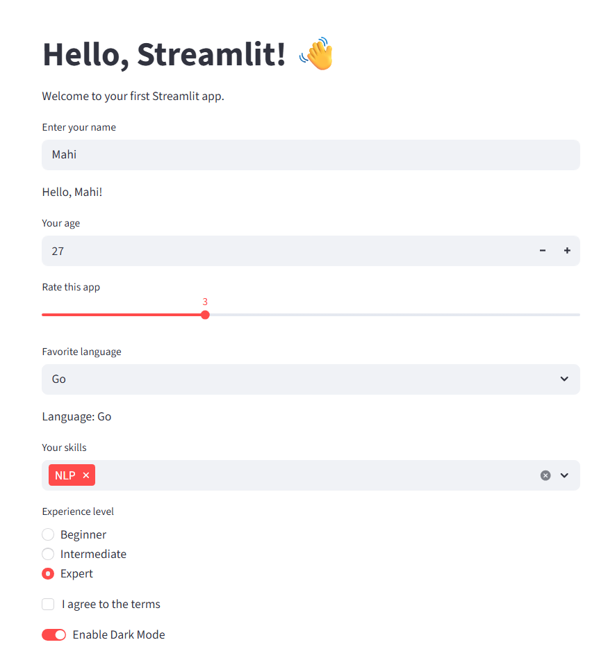

<div align="center">

# 🚀 Streamlit Zero to Hero

**Build beautiful, interactive web apps in pure Python — no frontend experience needed!**

[](https://streamlit.io)
[](https://python.org)
[](LICENSE)
[](CONTRIBUTING.md)

</div>

---

## 📖 Table of Contents

- [What is Streamlit?](#-what-is-streamlit)
- [Prerequisites](#-prerequisites)
- [Installation](#-installation)
- [Quick Start](#-quick-start)
- [Core Concepts](#-core-concepts)
  - [Text & Markdown](#1-text--markdown)
  - [Data Display](#2-data-display)
  - [Charts & Visualization](#3-charts--visualization)
  - [Widgets & Interactivity](#4-widgets--interactivity)
  - [Layout & Columns](#5-layout--columns)
  - [Sidebar](#6-sidebar)
  - [File Upload & Download](#7-file-upload--download)
  - [State Management](#8-state-management)
  - [Caching](#9-caching)
  - [Theming](#10-theming)
- [Real-World Examples](#-real-world-examples)
- [Deployment](#-deployment)
- [Best Practices](#-best-practices)
- [Common Issues & Fixes](#-common-issues--fixes)
- [Deployment of Streamlitapp for free](#Deployment-Streamlit-App-Free)
- [Resources](#-resources)
- [Contributing](#-contributing)
- [License](#-license)

---

## 💡 What is Streamlit?

[Streamlit](https://streamlit.io) is an **open-source Python framework** that lets you turn data scripts into shareable web apps in minutes.

| Feature | Description |
|--------|-------------|
| 🐍 Pure Python | No HTML, CSS, or JavaScript needed |
| ⚡ Fast Prototyping | Go from script to app in minutes |
| 🔄 Auto-Reloading | App refreshes instantly on code change |
| 🧩 Rich Widgets | Sliders, buttons, inputs, file uploaders & more |
| 📊 Built-in Charts | Native support for Pandas, Plotly, Altair, etc. |
| ☁️ Easy Deployment | Deploy free on [Streamlit Community Cloud](https://streamlit.io/cloud) |

---
## When to restart app or when to just refresh browser.
## 🔁 Quick Decision Guide

```
Made a change?
    │
    ├── Changed app.py code (UI, logic, widgets)?
    │       → Just SAVE the file ✅ (Streamlit auto-detects)
    │
    ├── Installed a new pip package?
    │       → RESTART the terminal ♻️
    │
    ├── Changed config.toml or secrets.toml?
    │       → RESTART the terminal ♻️
    │
    ├── Edited a @st.cache_resource function?
    │       → Clear cache OR RESTART ♻️
    │
    └── Edited a helper module (utils.py, etc.)?
            → Usually auto-detected, but if not → RESTART ♻️
```
## 🧠 Bottom Line

> **90% of the time — just save your file.**
> Streamlit will show the reload banner automatically.
> Only **restart the process** when you change packages, config files, or secrets. 🚀

---

## ✅ Prerequisites

Before you begin, make sure you have:

- Python **3.8** or higher
- pip (Python package manager)
- Basic Python knowledge

Check your Python version:
```bash
python --version
```

---

## 📦 Installation

### 1. Create a virtual environment (recommended)

```bash
# Create a virtual environment
python -m venv venv

# Activate it
# On Windows:
venv\Scripts\activate

# On macOS/Linux:
source venv/bin/activate
```

### 2. Install Streamlit

```bash
pip install streamlit
```

### 3. Verify installation

```bash
streamlit hello
```

This launches the official Streamlit demo app in your browser. 🎉

---

## ⚡ Quick Start

Create your first app in **3 steps**:

**Step 1:** Create a file `app.py`

```python
import streamlit as st

st.title("Hello, Streamlit! 👋")
st.write("Welcome to your first Streamlit app.")

name = st.text_input("What's your name?")
if name:
    st.success(f"Hello, {name}! 🎉")
```

**Step 2:** Run the app

```bash
streamlit run app.py
```

**Step 3:** Open your browser at `http://localhost:8501` 🌐

---

## 🧩 Core Concepts

### 1. Text & Markdown

```python
import streamlit as st

st.title("🎯 Main Title")
st.header("📌 Header")
st.subheader("🔹 Subheader")
st.text("Plain text output")
st.markdown("**Bold**, *Italic*, `code`, [link](https://streamlit.io)")
st.caption("Small caption text")
st.code("print('Hello, Streamlit!')", language="python")
st.latex(r"E = mc^2")

# Divider
st.divider()

# Write (smart display — works with almost anything)
st.write("This is a string")
st.write(42)
st.write({"key": "value"})
```

---

### 2. Data Display

```python
import streamlit as st
import pandas as pd

df = pd.DataFrame({
    "Name": ["Alice", "Bob", "Charlie"],
    "Age": [25, 30, 35],
    "Score": [88.5, 92.3, 78.0]
})

# Display a table
st.dataframe(df)                     # Interactive table
st.table(df)                          # Static table
st.data_editor(df)                    # Editable table

# Display metrics
col1, col2, col3 = st.columns(3)
col1.metric("Temperature", "23°C", "+1.2°C")
col2.metric("Accuracy", "94.2%", "-0.5%")
col3.metric("Users", "1,250", "+50")

# Display JSON
st.json({"name": "Alice", "age": 25, "active": True})
```

---

### 3. Charts & Visualization

```python
import streamlit as st
import pandas as pd
import numpy as np

data = pd.DataFrame(
    np.random.randn(100, 3),
    columns=["A", "B", "C"]
)

# Built-in charts
st.line_chart(data)
st.bar_chart(data)
st.area_chart(data)
st.scatter_chart(data)

# Plotly
import plotly.express as px
fig = px.scatter(data, x="A", y="B", color="C", title="Plotly Scatter")
st.plotly_chart(fig, use_container_width=True)

# Matplotlib
import matplotlib.pyplot as plt
fig, ax = plt.subplots()
ax.plot(data["A"].values, color="tomato")
ax.set_title("Matplotlib Line Plot")
st.pyplot(fig)

# Altair
import altair as alt
chart = alt.Chart(data.reset_index()).mark_line().encode(
    x="index", y="A"
)
st.altair_chart(chart, use_container_width=True)
```

---

### 4. Widgets & Interactivity

```python
import streamlit as st

# Text input
name = st.text_input("Enter your name", placeholder="e.g. Alice")
st.write(f"Hello, {name}!")

# Number input
age = st.number_input("Your age", min_value=1, max_value=120, value=25)

# Slider
rating = st.slider("Rate this app", 0, 10, 5)

# Select box
language = st.selectbox("Favorite language", ["Python", "JavaScript", "Go", "Rust"])

# Multiselect
skills = st.multiselect("Your skills", ["ML", "Data Viz", "NLP", "CV", "MLOps"])

# Radio buttons
level = st.radio("Experience level", ["Beginner", "Intermediate", "Expert"])

# Checkbox
agree = st.checkbox("I agree to the terms")
if agree:
    st.success("Thanks for agreeing!")

# Toggle
dark_mode = st.toggle("Enable Dark Mode")

# Date & Time
dob = st.date_input("Date of birth")
time = st.time_input("Meeting time")

# Color picker
color = st.color_picker("Pick a color", "#FF4B4B")

# Button
if st.button("🚀 Submit"):
    st.balloons()
    st.success("Submitted successfully!")
```



---

### 5. Layout & Columns

```python
import streamlit as st

# Columns
col1, col2, col3 = st.columns(3)
with col1:
    st.header("Column 1")
    st.write("Content A")

with col2:
    st.header("Column 2")
    st.write("Content B")

with col3:
    st.header("Column 3")
    st.write("Content C")

# Columns with custom width ratios
left, right = st.columns([2, 1])
with left:
    st.write("Wider left column")
with right:
    st.write("Narrower right column")

# Expander
with st.expander("🔽 Click to expand"):
    st.write("Hidden content revealed!")

# Tabs
tab1, tab2, tab3 = st.tabs(["📊 Data", "📈 Charts", "⚙️ Settings"])
with tab1:
    st.write("Data view")
with tab2:
    st.write("Chart view")
with tab3:
    st.write("Settings view")

# Container
with st.container():
    st.write("This is inside a container")

# Empty (placeholder for dynamic updates)
placeholder = st.empty()
placeholder.text("Loading...")
placeholder.success("Done! ✅")
```

---

### 6. Sidebar

```python
import streamlit as st

# Sidebar widgets
st.sidebar.title("⚙️ Settings")
st.sidebar.markdown("---")

model = st.sidebar.selectbox("Choose Model", ["Model A", "Model B", "Model C"])
threshold = st.sidebar.slider("Confidence Threshold", 0.0, 1.0, 0.5)
debug = st.sidebar.checkbox("Enable Debug Mode")

st.sidebar.markdown("---")
st.sidebar.info("Adjust settings above to configure the app.")

# Main content
st.title("My App")
st.write(f"Selected Model: **{model}**")
st.write(f"Confidence Threshold: **{threshold}**")
```

---

### 7. File Upload & Download

```python
import streamlit as st
import pandas as pd

# File upload
uploaded_file = st.file_uploader(
    "Upload a CSV file",
    type=["csv"],
    help="Upload your dataset here"
)

if uploaded_file is not None:
    df = pd.read_csv(uploaded_file)
    st.success(f"✅ Loaded {len(df)} rows and {len(df.columns)} columns.")
    st.dataframe(df.head())

    # File download
    csv = df.to_csv(index=False).encode("utf-8")
    st.download_button(
        label="📥 Download Processed CSV",
        data=csv,
        file_name="processed_data.csv",
        mime="text/csv"
    )

# Multiple files
files = st.file_uploader("Upload images", type=["png", "jpg", "jpeg"], accept_multiple_files=True)
for file in files:
    st.image(file, caption=file.name, use_container_width=True)
```

---

### 8. State Management

```python
import streamlit as st

# Initialize session state
if "counter" not in st.session_state:
    st.session_state.counter = 0

if "history" not in st.session_state:
    st.session_state.history = []

# Buttons that modify state
col1, col2, col3 = st.columns(3)
with col1:
    if st.button("➕ Increment"):
        st.session_state.counter += 1
        st.session_state.history.append(st.session_state.counter)
with col2:
    if st.button("➖ Decrement"):
        st.session_state.counter -= 1
        st.session_state.history.append(st.session_state.counter)
with col3:
    if st.button("🔄 Reset"):
        st.session_state.counter = 0
        st.session_state.history = []

st.metric("Counter", st.session_state.counter)
st.line_chart(st.session_state.history)
```

---

### 9. Caching

```python
import streamlit as st
import pandas as pd
import time

# Cache data (for data loading — persists across reruns)
@st.cache_data
def load_data(filepath: str) -> pd.DataFrame:
    time.sleep(2)  # Simulate slow loading
    return pd.read_csv(filepath)

# Cache resources (for ML models, DB connections — shared across sessions)
@st.cache_resource
def load_model():
    from sklearn.ensemble import RandomForestClassifier
    model = RandomForestClassifier()
    # model.fit(X_train, y_train)  # Train your model here
    return model

st.title("Caching Demo")

with st.spinner("Loading data..."):
    # df = load_data("data.csv")  # Only loads once!
    st.success("Data loaded (cached after first run)! ⚡")

model = load_model()
st.write("Model loaded:", type(model).__name__)
```

---

### 10. Theming

Create a `.streamlit/config.toml` file to customize the theme:

```toml
[theme]
primaryColor = "#FF4B4B"
backgroundColor = "#0E1117"
secondaryBackgroundColor = "#262730"
textColor = "#FAFAFA"
font = "sans serif"
```

Or switch between light/dark from the menu: **☰ → Settings → Theme**

---

## 🌟 Real-World Examples

### 📊 Data Dashboard

```python
import streamlit as st
import pandas as pd
import plotly.express as px
import numpy as np

st.set_page_config(page_title="Sales Dashboard", page_icon="📊", layout="wide")
st.title("📊 Sales Dashboard")

# Simulated data
np.random.seed(42)
df = pd.DataFrame({
    "Month": pd.date_range("2025-01-01", periods=12, freq="ME"),
    "Sales": np.random.randint(5000, 20000, 12),
    "Region": np.random.choice(["North", "South", "East", "West"], 12)
})

# KPIs
col1, col2, col3 = st.columns(3)
col1.metric("Total Sales", f"${df['Sales'].sum():,.0f}", "+12%")
col2.metric("Avg Monthly Sales", f"${df['Sales'].mean():,.0f}", "+5%")
col3.metric("Best Month", df.loc[df["Sales"].idxmax(), "Month"].strftime("%b %Y"))

st.divider()

# Charts
left, right = st.columns(2)
with left:
    fig = px.line(df, x="Month", y="Sales", title="Monthly Sales Trend", markers=True)
    st.plotly_chart(fig, use_container_width=True)

with right:
    fig2 = px.pie(df, values="Sales", names="Region", title="Sales by Region")
    st.plotly_chart(fig2, use_container_width=True)
```

---

### 🤖 ML Model Predictor

```python
import streamlit as st
import numpy as np

st.set_page_config(page_title="Iris Predictor", page_icon="🌸")
st.title("🌸 Iris Flower Predictor")

@st.cache_resource
def load_model():
    from sklearn.datasets import load_iris
    from sklearn.ensemble import RandomForestClassifier
    X, y = load_iris(return_X_y=True)
    model = RandomForestClassifier(n_estimators=100, random_state=42)
    model.fit(X, y)
    return model

model = load_model()
classes = ["Setosa 🌸", "Versicolor 🌺", "Virginica 🌼"]

st.sidebar.header("🔬 Input Features")
sepal_length = st.sidebar.slider("Sepal Length (cm)", 4.0, 8.0, 5.5)
sepal_width  = st.sidebar.slider("Sepal Width (cm)",  2.0, 4.5, 3.0)
petal_length = st.sidebar.slider("Petal Length (cm)", 1.0, 7.0, 4.0)
petal_width  = st.sidebar.slider("Petal Width (cm)",  0.1, 2.5, 1.2)

features = np.array([[sepal_length, sepal_width, petal_length, petal_width]])
prediction = model.predict(features)[0]
probabilities = model.predict_proba(features)[0]

st.subheader("Prediction")
st.success(f"**Predicted Class:** {classes[prediction]}")

st.subheader("Class Probabilities")
prob_df = {"Class": classes, "Probability": probabilities}
import pandas as pd
st.bar_chart(pd.DataFrame(prob_df).set_index("Class"))
```

---

## ☁️ Deployment

### Option 1: Streamlit Community Cloud (Free & Easiest)

1. Push your app to a **public GitHub repo**
2. Go to [share.streamlit.io](https://share.streamlit.io)
3. Connect your GitHub account
4. Select repo → branch → main file (e.g., `app.py`)
5. Click **Deploy** 🚀

> 💡 Add a `requirements.txt` to your repo with all dependencies!

---

### Option 2: Docker

```dockerfile
FROM python:3.11-slim

WORKDIR /app
COPY requirements.txt .
RUN pip install --no-cache-dir -r requirements.txt

COPY . .
EXPOSE 8501

HEALTHCHECK CMD curl --fail http://localhost:8501/_stcore/health

ENTRYPOINT ["streamlit", "run", "app.py", \
  "--server.port=8501", \
  "--server.address=0.0.0.0"]
```

```bash
docker build -t my-streamlit-app .
docker run -p 8501:8501 my-streamlit-app
```

---

### Option 3: Requirements File

```text name=requirements.txt
streamlit>=1.32.0
pandas>=2.0.0
numpy>=1.24.0
plotly>=5.15.0
scikit-learn>=1.3.0
matplotlib>=3.7.0
altair>=5.0.0
```

---

## ✅ Best Practices

| Practice | Details |
|----------|---------|
| 🧠 Use `@st.cache_data` | Cache DataFrames, API responses, and file reads |
| 🔧 Use `@st.cache_resource` | Cache ML models, DB connections, and heavy objects |
| 📁 Use `st.session_state` | Persist state across widget interactions |
| 🗂️ Organize with pages | Use `pages/` folder for multi-page apps |
| 🎨 Set `set_page_config` | Always call it as the **first Streamlit command** |
| 🔐 Use `st.secrets` | Store API keys and credentials securely |
| 🗃️ Modularize code | Break large apps into functions and modules |
| 📝 Add docstrings | Document functions and pages clearly |

---

## 🐛 Common Issues & Fixes

| Issue | Cause | Fix |
|-------|-------|-----|
| App re-runs on every interaction | Normal Streamlit behavior | Use `st.session_state` and `@st.cache_data` |
| `set_page_config` error | Called after other Streamlit commands | Move it to the **very top** of the file |
| Slow data loading | No caching | Add `@st.cache_data` to data-loading functions |
| Secrets not loading | `secrets.toml` missing | Create `.streamlit/secrets.toml` |
| Port already in use | Another app is running | Use `streamlit run app.py --server.port 8502` |
| Large file upload fails | Default limit is 200MB | Set `server.maxUploadSize` in `config.toml` |

---
# Deployment Streamlit App Free

https://mahicalculator.streamlit.app/
### 1. Streamlit Community Cloud *(Easiest & Most Recommended)*

This is the **official free hosting platform** by Streamlit.

**Steps:**
1. Push your Streamlit app to a **public GitHub repository**
2. Go to [share.streamlit.io](https://share.streamlit.io)
3. Sign in with your GitHub account
4. Click "New app" and select your repository, branch, and main Python file
5. Click "Deploy!" – your app will be live in minutes!

**Requirements:**
- A `requirements.txt` file listing your dependencies
- A main Python file (e.g., `app.py`)

**Sample `requirements.txt`:**
```
streamlit
pandas
numpy
```

**Example app structure:**
```
my-streamlit-app/
├── app.py
├── requirements.txt
└── README.md
```

**Recommendation:**
Start with [Streamlit Community Cloud](https://share.streamlit.io) — it's the simplest,
purpose-built for Streamlit, and completely free. Just make sure your code is in a
public GitHub repository. 🎉

---
## 📚 Resources

- 📖 [Official Streamlit Docs](https://docs.streamlit.io)
- 🎨 [Streamlit Component Gallery](https://streamlit.io/components)
- 🌐 [Streamlit Community Forum](https://discuss.streamlit.io)
- ☁️ [Streamlit Cloud](https://streamlit.io/cloud)
- 🐙 [Streamlit GitHub](https://github.com/streamlit/streamlit)
- 🎓 [30 Days of Streamlit](https://30days.streamlit.app)
- 📦 [Awesome Streamlit](https://github.com/MarcSkovMadsen/awesome-streamlit)

---

## 🤝 Contributing

Contributions, issues, and feature requests are welcome!

1. Fork this repository
2. Create a branch: `git checkout -b feature/your-feature`
3. Commit your changes: `git commit -m "Add your feature"`
4. Push to the branch: `git push origin feature/your-feature`
5. Open a Pull Request 🙌

---

## 📄 License

This project is licensed under the **MIT License** — see the [LICENSE](LICENSE) file for details.

---

<div align="center">

Made with ❤️ by [mahibarauniyar](https://github.com/mahibarauniyar)

⭐ Star this repo if you found it helpful!

</div>